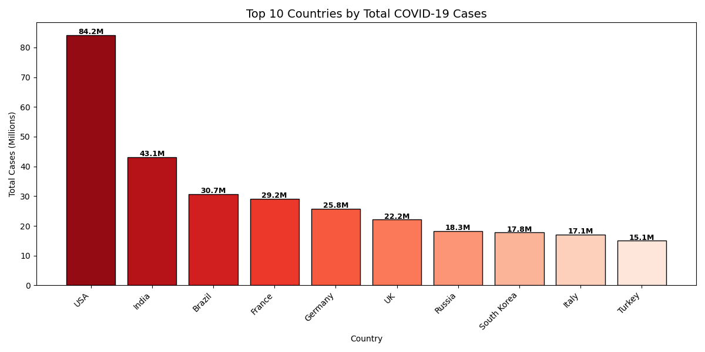
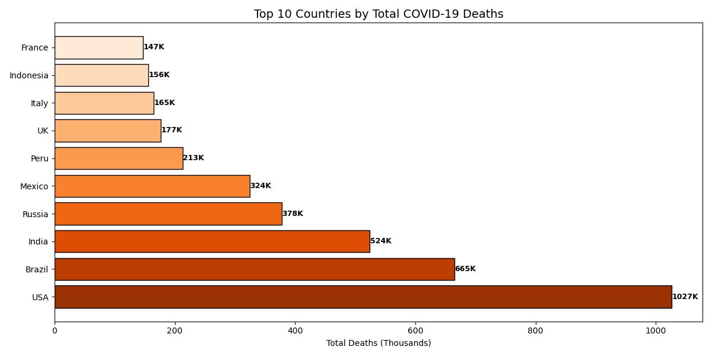
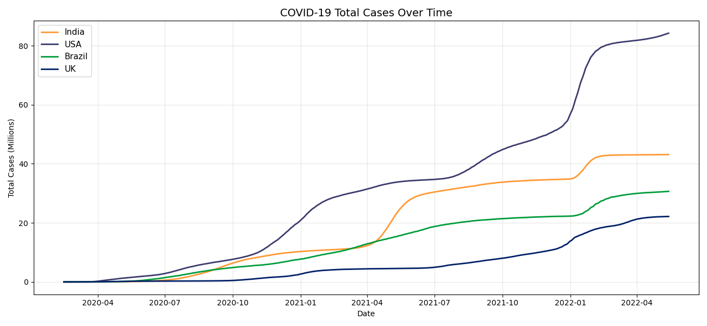
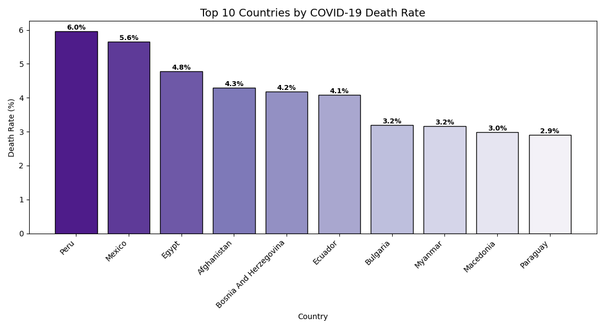
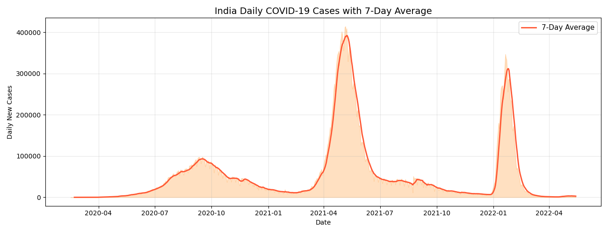

# COVID-19 Global Data Analysis 🦠

Analysis of COVID-19 cases, deaths and vaccinations
across 200+ countries using live data.

## Tools Used
- Python, Pandas, Matplotlib, Seaborn

## Questions Answered
- Which countries had the most cases and deaths?
- How did cases grow over time across major countries?
- Which countries had the highest death rates?
- Which countries vaccinated the most people?
- How did India's daily cases wave look over time?

## Key Findings
- USA had the highest total cases globally
- India saw two distinct waves clearly visible in daily case data
- Death rates varied significantly across countries
- Small island nations led vaccination percentages

## Charts

